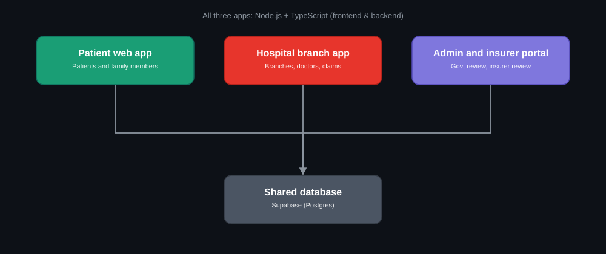
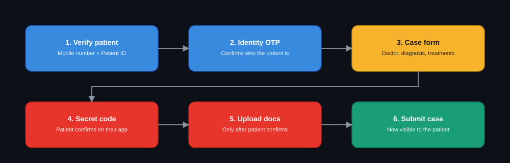
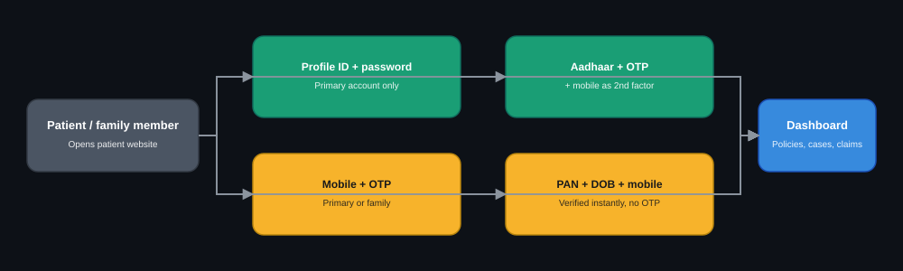
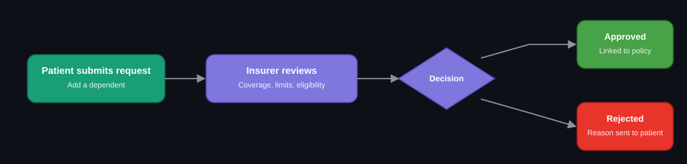
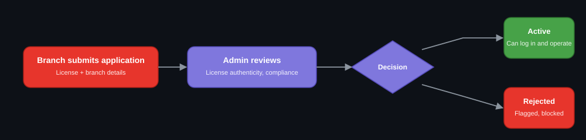

<div align="center">


<br/>


</div>

---

## 📌 Overview

**HealthVault** is a three-application insurance and hospital-care platform connecting
**patients**, **hospital branches**, and **admin/insurer staff** through one shared backend
data layer. A hospital can only act on a patient's behalf after the patient has personally
verified it — twice, through two separate mechanisms — and every approval-driven process
(family enrollment, hospital onboarding, claims) runs through an explicit review queue instead
of being self-service.



Three independently deployable apps, all **Node.js + TypeScript** (frontend and backend),
coordinating through one shared **Supabase (Postgres)** database — because a case the hospital
creates has to become visible to the patient, and a request the patient submits has to be
reviewable by the admin/insurer side. A shared source of truth is what makes that possible
without the three apps constantly calling each other's internal APIs.

---

## 🧩 The three applications

<table>
<tr><td width="33%" valign="top">

### 🧑‍⚕️ Patient Web App
- Profile & family member management
- View policies — coverage, used, remaining
- Submit family-member addition requests
- Book appointments, view medical history
- Download lab reports & invoices
- Track claim approval status
- Four login methods (see below)

</td><td width="33%" valign="top">

### 🏥 Hospital Branch App
- Look up patients by Patient ID
- Review medical history
- Process appointments & treatment
- Submit insurance claims on a patient's behalf
- Assign doctors, schedule rooms
- OTP + secret-code verified document upload

</td><td width="34%" valign="top">

### 🛡️ Admin & Insurer Portal
- Verify hospital branch licenses
- Approve / reject branch onboarding
- Review family-member addition requests
- Validate policy coverage & eligibility
- Approve / reject claims

</td></tr>
</table>

---

## 🔐 Identity, Consent & Approval Workflows

### Hospital case submission — two separate confirmations, not one



The identity OTP (step 2) proves the hospital is talking to the right *person*. The secret
code (step 4) is a **separate** confirmation the patient must give from their own logged-in
account — it can't be relayed through hospital staff, because the hospital never sees the
code. Document upload is blocked server-side until that confirmation lands, not just hidden in
the UI.

### Patient login — four methods, one dashboard



All four methods resolve to either the primary account holder or a linked family member,
whichever record matches what's entered. Family members see the same dashboard but can't
change the selected policy or approve requests — those stay primary-account-only actions.

### Family member enrollment & approval



### Hospital branch onboarding & approval



No hospital branch can register itself into an active, operating state — every branch sits in
a pending queue until an admin reviews its license and compliance records.

---

## 🧰 Tech Stack

| Layer | Technology |
|---|---|
| Patient App — frontend | React + TypeScript |
| Patient App — backend | Node.js + TypeScript |
| Hospital App — frontend | React + TypeScript |
| Hospital App — backend | Node.js + TypeScript |
| Admin & Insurer Portal | React + TypeScript (frontend & backend) |
| Database | Supabase (Postgres) |
| Auth / OTP | Custom layer over Supabase (SMTP OTP, mobile OTP) |
| File storage | Supabase Storage |
| Access control | Row Level Security (RLS) policies per role |

---

## ✨ Key Features

- 🔒 **Two-stage hospital verification** — identity OTP, then a separate patient-confirmed secret code before any document upload
- 👪 **Family member access** — linked accounts share a dashboard, with primary-only controls for sensitive actions
- 📋 **Approval queues, not self-service** — family enrollment, hospital onboarding, and claims all go through explicit review
- 📧 **Gmail-verified registration** — SMTP OTP on sign-up, with optional (skippable) government ID verification
- 📅 **Appointments & medical records** — book with registered branches, view history, download reports and invoices
- 💰 **Insurance usage dashboard** — coverage used vs. remaining, broken down by policy and by month
- 🗄️ **One shared database, three apps** — Supabase keeps patient, hospital, and admin data consistent without a custom sync layer

---

## 🚀 Getting Started

```bash
git clone https://github.com/<your-org>/carelink-platform.git
cd carelink-platform
```

Each app (`patient-app/`, `hospital-app/`, `admin-portal/`) has its own `frontend/` and
`backend/`, and its own `package.json`:

```bash
cd patient-app/backend && npm install && npm run dev
cd patient-app/frontend && npm install && npm run dev
```

Repeat for `hospital-app/` and `admin-portal/`. All three backends read the same Supabase
project — set the same `SUPABASE_URL` and `SUPABASE_SERVICE_ROLE_KEY` in each app's `.env`.

```env
SUPABASE_URL=your-project-url
SUPABASE_SERVICE_ROLE_KEY=your-service-role-key
SUPABASE_ANON_KEY=your-anon-key
JWT_SECRET=change-this
SMTP_EMAIL=your-email@gmail.com
SMTP_APP_PASSWORD=your-app-password
```

> ⚠️ Never commit `.env` files or Supabase service-role keys to GitHub.

---

## 🔮 Roadmap

- [ ] Real government eKYC integration (Aadhaar/PAN) to replace last-4-digit matching
- [ ] Real SMS gateway for OTPs (currently logged server-side in development)
- [ ] Mobile apps for patients and hospital staff
- [ ] Automated claim-eligibility pre-checks before admin review

---

<div align="center">

## 📫 Contact

**Gunda Tejeswara Rao**
[](https://github.com/gundatejeswararao7)

## ⭐ Support

If you find this project useful, consider giving the repository a star.

<br/>


</div>
